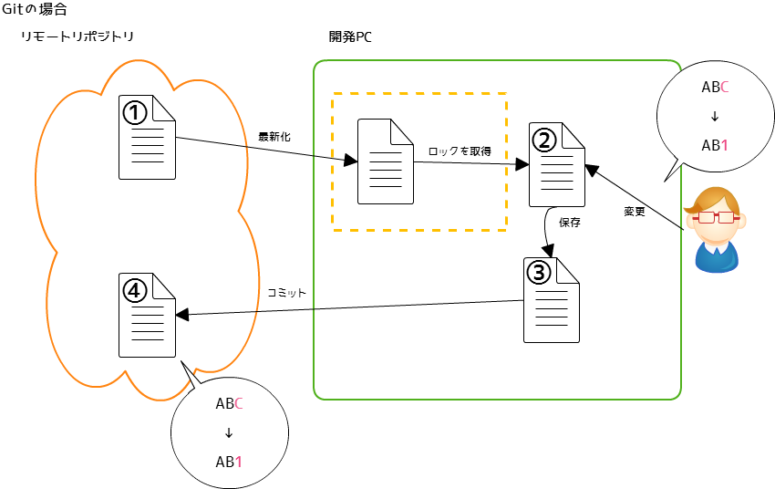
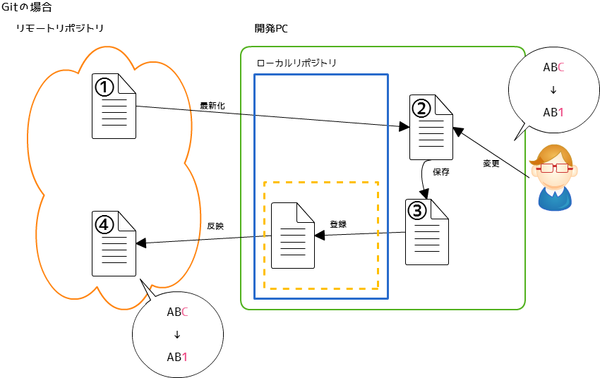
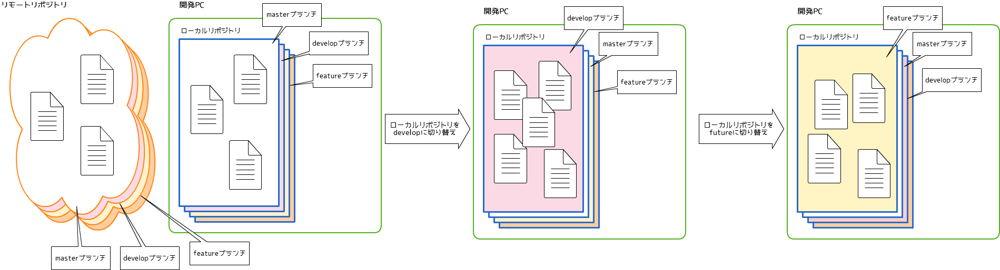
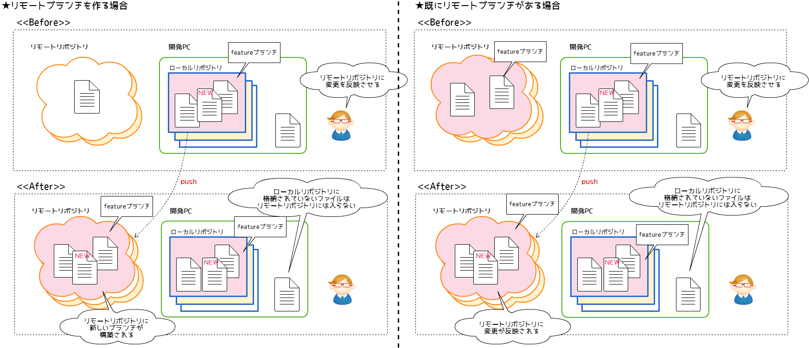
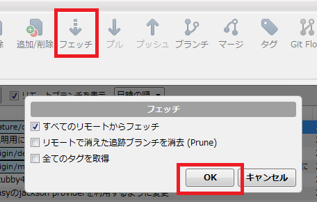
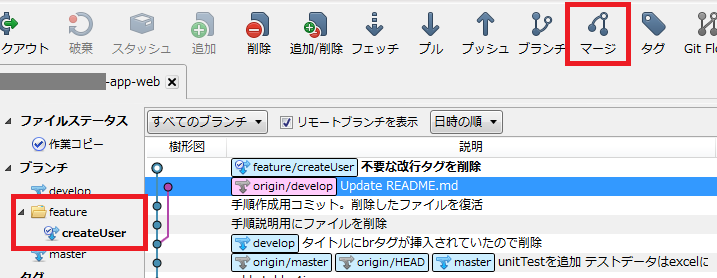
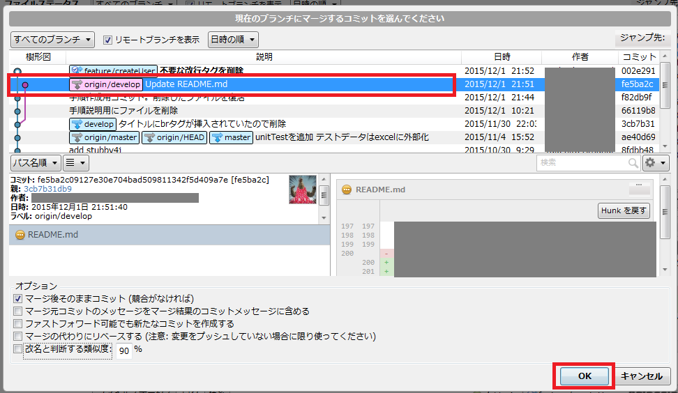
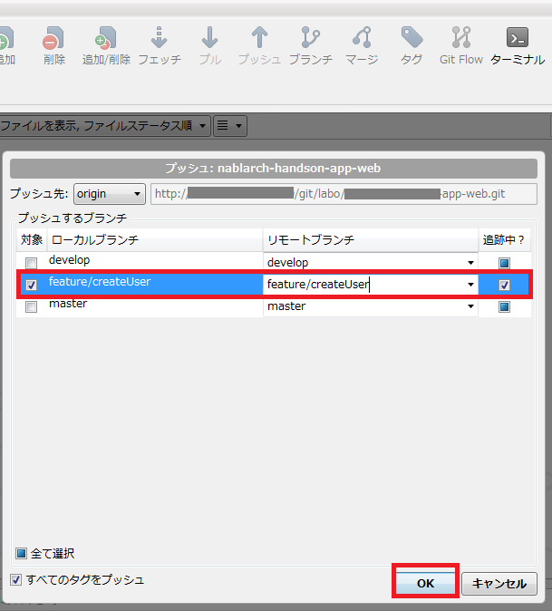
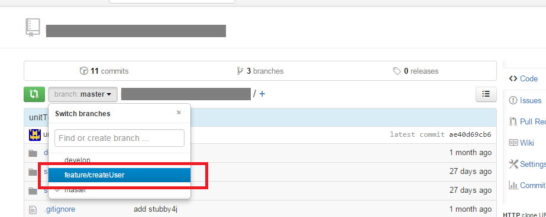

# とりあえずはじめてみよう！SubversionはわかるひとのGitのはじめかた

## 対象読者

以下全てに当てはまる人を対象読者としています。

- Subversionでの構成管理経験がある。
- Gitを使うのは初めて。
- PG・UT工程でとりあえずは困らない程度の知識をつけたい。
- SourceTreeのインストールが完了している。

## 記載内容

### 書いていること

- 基本的な考え方（リモートとローカル、ブランチ）
- 開発をすすめていくなかでの最低限の操作内容

### 書いていないこと

- そもそも構成管理とはなにか
- GitはSubversionと比べてなにが良いか
- ツールのインストール方法、初期設定方法(環境構築ガイドに書いてあるようなこと)
- 実行コマンド
- 高度な使い方

## 使うツール

### 開発PC

- git
- SourceTree

### リモートリポジトリ

- gitBucket(ブラウザから参照出来る画面です。)

## 基本的な考えかた

Subversionでの開発者の操作とGitでの開発者の動作を記載します。  
以下の2つの図を見比べると、開発者の操作はほぼかわりません。  
※SubversionにはあってGitにない操作、GitにあってSubversionにない操作を黄色枠で囲っています。  
本章では、**Gitにはローカルリポジトリというものがある**ということを覚えてください。  

### Subversionの操作のながれ

### Gitの操作のながれ

### ローカルリポジトリとは

ローカルリポジトリとは、開発PC内で（オフラインで）コミットの記録を保管しておける領域です。  
Gitでは、ローカルリポジトリに一度変更差分を登録し、その変更差分をリモートリポジトリに反映していきます。  
リモートリポジトリはgitBucketにて管理しているリポジトリのことです。  
ローカルリポジトリへの登録は"**自分だけ**"がわかり、それをリモートリポジトリへ反映することで"**チームへ**"展開することが出来ます。  
操作が"**ローカルリポジトリに対して**"か"**リモートリポジトリに対して**"かを意識することで、Gitがわかりやすくなります。  
以下解説では、上図のようにローカルリポジトリ・リモートリポジトリをイメージとして分けて解説していきます。

## ブランチについて

(Subversionでは開発のために各開発者がブランチをきることはありませんでしたが、)  
Gitでは各開発者がブランチを切って開発をすすめていきます。  
PGUT工程中は、主に以下のような種類のブランチができます。

- masterブランチ：本番環境へリリースするソースコードを管理するブランチ(開発者は基本的にさわらない)
- developブランチ：開発中のソースコードを管理するブランチ。既にレビューに合格しているもののみ格納する
- featureブランチ：開発者が作成し、開発者が削除するブランチ。開発中かつレビュー合格前のソースコードを格納する

### イメージ

ブランチのイメージは以下図を参照ください。  
ブランチを切り替えると、ローカルファイルがブランチの断面に応じて変更されていきます。  
今自分がどのブランチにいるのかを意識しましょう。  
なお、上記"Gitの操作の流れ"のイメージ図に記載しましたが、各開発者は開発PCのローカルリポジトリのファイルに対して変更を行います。  

## プロジェクト参加のときにやること

まずはプロジェクトを開発PCへ取得しましょう。  
※Subversionでいう、チェックアウトです。

### イメージ

開発PCにリモートリポジトリにて管理しているファイルをコピーする。

### 手順

① ブラウザからgitBucketを開いてください。
② 赤枠の文字列をコピーしてください。

③ SourceTreeを起動してください。
④ 赤枠のボタンを押し、出てきた画面に以下を入力する
   - 元のパス/URL ：　gitBucketからコピーしてきたURL
   - 保存先のパス：ワークスペースにしたいフォルダ
   - ブックマーク＞名前：そのまま

⑤ クローンボタンを押してください。これが、イメージ図の"**clone**"の作業です。

### 完了状態

開発PCに、リモートリポジトリと同じ状態のリポジトリが生成されました。
指定したフォルダにファイルが格納されているので、確認してみましょう。

## 開発の最初にやること

開発をスタートしましょう。  
　　
自分の開発PCのソースコードを最新化し、開発の開始ポイントを明確にします。  
  
明確にここから開発を始める！というポイントを作ることで、ソースコードレビューのときにレビュー対象の範囲が明確になります。  
開発単位は処理ごとでもメソッドごとでもクラス単位でもいいですが、2、3日ほどで作成し、レビューしてもらえる程度を目安としましょう。  
（開発単位が長期間になると、ソースコードの競合などが発生しやすくなります。Gitのマージ機能は強力ですが、なるべく競合を発生させないように運用しましょう。
　また、細かくレビューを出すことで、レビュアーの負荷を減らすことができます。）  
  
※競合が発生した場合の解決方法については本ドキュメントには記載しません。

### イメージ図

自分が開発をすすめていくためのブランチを作成する。

### 手順

手順は1αと1βでわけました。  
PJをcloneしてきたばかりの人は手順1α⇒手順2を、以前作業1αを実施済みの人は作業1β⇒作業2を参照してください。

### 手順1α(cloneしてきたばかりの人用)

① SourceTreeを起動してください。  
② チェックアウトボタンを押す。  
③ 新規ブランチをチェックアウトを選択し、プルダウンリストからdevelopブランチを選択してください。  
④ 新ブランチ名は自動で入ります。問題なければそのまま。  

⑤ OKを押してください。これが、イメージ図のひとつめの"**checkout**"の作業です。  

### 完了状態

開発PCにdevelopブランチと同じ状態のリポジトリを作成できました。  
各開発者はdevelopブランチに格納されているファイルを元に開発を進めていきます。

### 手順1β(すでにdevelopブランチを作っている人用)

① SourceTreeを起動してください。  
② 赤枠のdevelopをダブルクリックしてください。  
③ developブランチに切り替わります。

### 手順書2

① SourceTreeを起動してください。  
② developブランチを**最新化**してください。(以下作業にてリモートリポジトリの変更をローカルに適用させることが出来ます。)  

③ ブランチボタンを押す。  
④ 現在のブランチが**develop**になっていることを確認してください。  
⑤ 新規ブランチにfeatureブランチの名前を入力してください。  
ブランチ名は機能をあらわす名称やチケット番号など、作成内容がわかるようにしてください。

⑥ OKを押してください。これがイメージ図のふたつめの"**checkout**"です。  

### 完了状態

開発PCにfeatureブランチを新規作成出来ました。  
開発者はfeatureブランチにて開発を進めてください。基本的にはfeatureブランチは個人で使用します。

## 開発中にやること(ローカルでの作業)

開発の記録を保存していきましょう。  
基本的に、「タスクとして一段落したらコミットする」ようにし、こまめにコミットしましょう。  
コミットしても、プッシュ（後述）するまでは他の開発者に対して変更は展開されません。  
コミットメッセージは、**必ず作業内容がわかるように記載しましょう。**  
  
**★コミットメッセージの悪い例**

- SQLファイルを修正
- 12/1作業分コミット
- 一旦コミット
  + なにを修正したのかがわからない

**★コミットメッセージのいい例**

- ダウンロードのヘッダ部について、yyyyMM形式からyyyy年MM月形式へ変更
- 画面の開きかたを修正。同一画面にて開くようにした
  + 変更内容を具体的に記載しており、なにをしたのかがわかる。
- refs #123
  + ※refs #(Redmineのチケット番号)
  + チケット番号から、なにをしたのかがわかる。

### イメージ図

### 手順

（コマンドにてgitを操作する場合はファイルの追加と変更で操作がかわりますが、SourceTreeでは同じ操作になります。）

① SourceTreeを起動します。  
② 「コミットされていない変更があります」の表記を確認し、「ファイルステータス」タブに切り替えます。

※？は追加したファイル、…は更新したファイルです。  
  
③ 変更内容を確認し、コミット対象ファイルを選択する。  
※必ず**コミットしたいファイルを選んで**チェックを付けてください。コミットメッセージにあったファイルを選択すること。  
④ 赤枠にコミットメッセージを記載する。  

⑤ コミットボタンを押してください。これがイメージ図の**add + commit**です。  

### 完了状態

開発PCに作業記録を保存することが出来ました。  

## 開発中にやること(リモートブランチへの反映)

開発の記録をリモートリポジトリに反映させましょう。  
自分の作成したブランチに対して変更を反映させるため、他の人からは見ることが出来ません。  
少なくとも一日の最後にはこの作業を実施しましょう。  
なお、ローカルリポジトリに登録していない変更はリモートリポジトリには反映されません。

### イメージ図

### 手順

① SourceTreeを起動します。  
② developブランチのソースコードから、最新の資源を取り込みます。  
  

③ developブランチの末尾のコミットを指定しOKボタンを押します。  

※**自分が作成したfeatureブランチの状態になっていることを確認**し、マージボタンを押下する。  
  
④ developブランチの末尾のコミットを指定しOKボタンを押します。  

これを実施することで、developブランチとfeatureブランチの差分を吸収し、  
developブランチへマージ後でもアプリケーションが正常に動作することを確認することが出来ます。  

マージ作業にて競合が発生した場合は、以下サイトを参照して解決してください。　　
http://naichilab.blogspot.jp/2014/01/git-4sourcetreegit.html
  
**⑤ ローカルにてテストを実行して、ソースコードに問題が発生していないことを確認してください。**  
⑥ プッシュボタンを押下してください。  
⑦ **featureブランチにのみ**チェックをいれてください。  
⑧ OKボタンを押してください。これが、イメージ図の**push**です。  

### 完了状態

リモートリポジトリに対してローカルの変更を反映させることが出来ました。  
gitBucket（ブラウザ）にて変更を確認してください。  
ブランチは画面の以下箇所にて切り替えることが出来ます。

## レビュー依頼のときにやること

タスクが完了したら、レビュアーにレビューを出しましょう。  
gitBucket上でpullRequest機能を使用することで、developブランチとfeatureブランチの差分を確認することが出来ます。  
レビューOKのもののみ、developブランチへ反映させることが出来ます。  
※本作業を怠ると、品質が保証されていないソースコードが他の開発者の環境に適用されてしまいます。必ず実施してください。  

### イメージ図

### 手順

① gitBucketの画面をひらきましょう。  
② 

コンフリクトが発生した場合の対応方法はどうしようか。

### 完了状態

## レビュー合格後にやること

### イメージ図

### 手順

### 完了状態