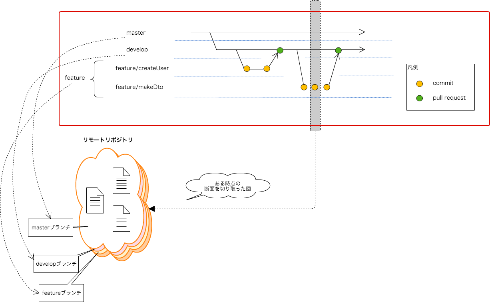

# Git利用ガイド

## 対象読者

以下全てに当てはまる人を対象読者としています。

- Subversionを利用した開発経験がある。
- Gitを使うのは初めて。
- SourceTreeをインストールしている。

## 記載内容

### 書いていること

- 基本的な考え方（リモートとローカル、ブランチ）
- 開発をすすめていくなかでの最低限の操作方法

### 書いていないこと

- そもそも構成管理とはなにか
- GitとSubversionの構成管理の考え方の違い
- ツールのインストール方法、初期設定方法(環境構築ガイドに書いてあるようなこと)
- 実行コマンド
- 高度な使い方

## 使うツール

### 開発PC

- git
- SourceTree

### リモートリポジトリ

- gitBucket(ブラウザから参照出来る画面です。)

## 基本的な考えかた

基本的な考え方はSubversionもGitも変わりません。  
どちらも、開発者はローカルにてソースコードの変更し、リモートリポジトリにて構成管理を行います。  
  
Subversionでの開発者の操作とGitでの開発者の操作を記載します。  
以下の2つの図を見比べてみても、開発者の操作はほぼかわりません。  
※SubversionにはあってGitにない操作、GitにあってSubversionにない操作を黄色枠で囲っています。  
本章では、**Gitにはローカルリポジトリというものがある**ということを覚えてください。  

### Subversionの操作のながれ

### Gitの操作のながれ

### ローカルリポジトリとは

ローカルリポジトリとは、開発PC内で（オフラインで）コミットの記録を保管しておける領域です。  
Gitでは、ローカルリポジトリに一度変更差分を登録し、その変更差分をリモートリポジトリに反映していきます。  
リモートリポジトリはgitBucketにて管理しているリポジトリのことです。  
ローカルリポジトリへの登録は"**自分だけ**"がわかり、それをリモートリポジトリへ反映することで"**チームへ**"展開することが出来ます。  
操作が"**ローカルリポジトリに対して**"か"**リモートリポジトリに対して**"かを意識することで、Gitがわかりやすくなります。  
以下解説では、上図のようにローカルリポジトリ・リモートリポジトリをイメージとして分けて解説していきます。

## ブランチについて

(Subversionでは開発のために各開発者がブランチをきることはなかったと思いますが、)  
Gitでは各開発者がブランチをきって開発をすすめていきます。  
Gitでは強力なマージ機能があります。そのため、ブランチをきっても、マージする際のコストはあまりかかりません。  
ブランチをわけ、マージする際にレビューする仕組みにすることで、ソースコードの品質を維持することができます。  
PGUT工程中は、主に以下のような種類のブランチができます。

- masterブランチ
  + チームにて管理するブランチ
  + 本番環境へリリースするソースコードを管理する
  + モジュール：ブランチ＝1：1
- developブランチ
  + チームにて管理するブランチ
  + 開発中のソースコードを管理する
  + 既にレビューに合格しているもののみ格納する
  + モジュール：ブランチ＝1：開発拠点数(※開発拠点が一箇所であれば1)
- featureブランチ
  + 開発者が作成し、開発者が削除するブランチ
  + 開発中かつレビュー合格前のソースコードを格納する
  + モジュール：ブランチ＝1：他

### ブランチの概念

以下図を参照ください。  
本ドキュメントでは、その時点でのソースコードの状態の断面を切り替えていくようなイメージでブランチを説明していきます。  
一つの断面が一つのブランチを意味していると読んでいってください。  
ブランチを切り替えることで、ローカルファイルがブランチごとに変更されていきます。  
今自分がどのブランチにいるのかを意識しましょう。  
なお、上記"Gitの操作の流れ"のイメージ図に記載しましたが、各開発者は開発PCのローカルリポジトリのファイルに対して変更を行います。  

なお、gitのブランチは以下のように、矢印を使用した図を用いてブランチの説明をすることが多いです。  
以下の記載方法では、ブランチの時系列を表すことが出来ます。

## 実際の操作

では、実際の操作方法について記載していきます。  
状況にあわせて以下リンクを参照してください。

[プロジェクト参加のときにやること(clone)](./git/clone.html)

[開発を始めるときにやること(checkout)](./git/checkout.html)

[開発中にやること(ローカルでの作業)(addとcommit)](./git/commit.html)

[開発中にやること(リモートブランチへの反映)(push)](./git/push.html)

[レビュー依頼のときにやること(pull request)](./git/pullRequest.html)

[レビュー指摘対応のときにやること](./git/review.html)

[レビュー合格後にやること(レビュアーが実施)(merge)](./git/finish.html)