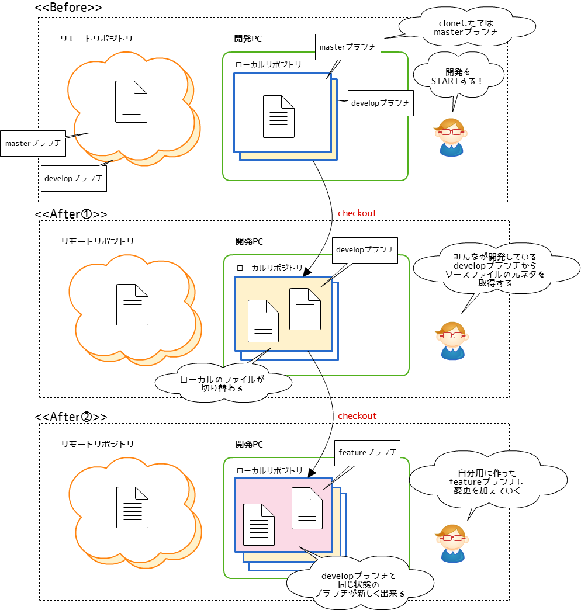
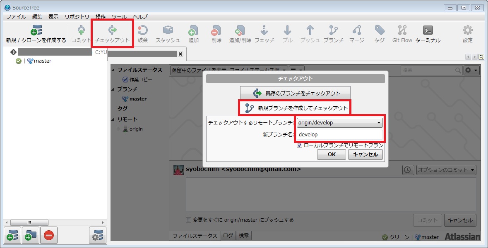
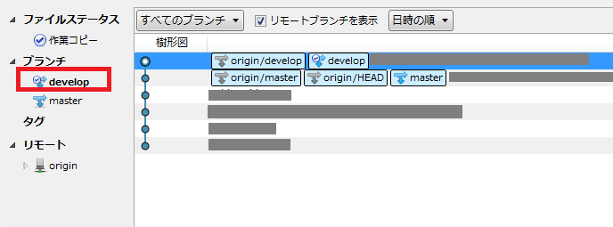
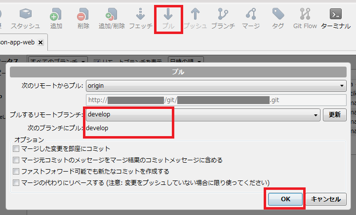
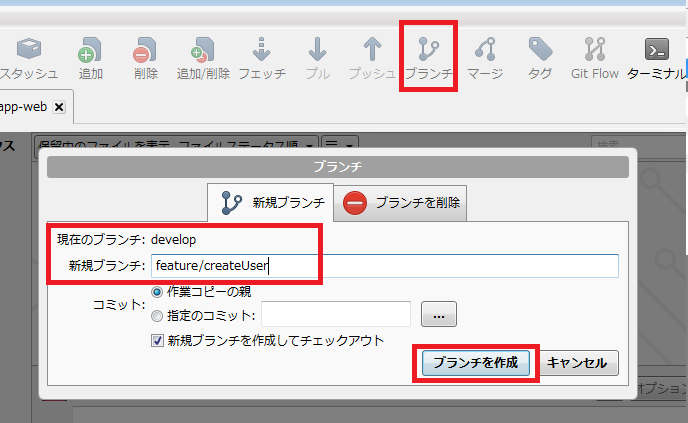

# 開発を始めるときにやること(checkout)

自分の開発PCのソースコードを最新化します。  
  
明確にここから開発を始める！というポイントを作る(ブランチをきる)ことで、ソースコードレビューのときにレビュー対象の範囲が明確になります。  
なお、ブランチのライフサイクル(※)は2、3日を目安としましょう。  
※ブランチの作成からレビュー完了、マージまで  
開発単位が長期間になると、ソースコードの競合などが発生しやすくなります。   
Gitのマージ機能は強力ですが、なるべく競合を発生させないように運用しましょう。  
また、細かくレビューを出すことで、レビュアーの1回のレビューあたりの負荷を減らすことができます。  
  
※競合が発生した場合の解決方法については本ドキュメントには記載しません。

## 作業の流れ

自分が開発をすすめていくためのブランチを作成する。

## 実際の操作

手順は1αと1βでわけました。  
ローカルに新しくリポジトリをcloseしてきたばかりの人は手順1α⇒手順2を実施してください。  
ローカルリポジトリに既にdevelopブランチがある人は都度都度、作業1β⇒作業2を実施してください。

### 手順1α(cloneしてきたばかりの人用)

① SourceTreeを起動してください。  
② チェックアウトボタンを押す。  
③ 新規ブランチをチェックアウトを選択し、プルダウンリストからdevelopブランチを選択してください。  
④ 新ブランチ名は自動で入ります。問題なければそのまま。  

⑤ OKを押してください。これが、イメージ図のひとつめの"**checkout**"の作業です。  

#### 完了状態

リモートリポジトリのdevelopブランチと同じ状態のブランチをローカルリポジトリに作成できました。  
各開発者はdevelopブランチからfeatureブランチを新たに作成し、開発を進めていきます。  
featureブランチの作成方法は手順2を参照してください。

### 手順1β(すでにdevelopブランチを作っている人用)

① SourceTreeを起動してください。  
② 赤枠のdevelopをダブルクリックしてください。  
③ developブランチに切り替わります。

#### 完了状態

リモートリポジトリのdevelopブランチとローカルリポジトリのdevelopブランチの状態が同じになりました。  
手順2にすすんでください。

### 手順2

① SourceTreeを起動してください。  
② developブランチを**最新化**してください。(以下作業にてリモートリポジトリの変更をローカルに適用させることが出来ます。)  

③ ブランチボタンを押す。  
④ 現在のブランチが**develop**になっていることを確認してください。  
⑤ 新規ブランチにfeatureブランチの名前を入力してください。  
ブランチ名は機能をあらわす名称やチケット番号など、作成内容がわかるようにしてください。
ブランチ名：feature/[タスク内容がわかる名前]
例）
- ユーザ作成機能のブランチの場合： feature/createUser
- Redmineのチケット番号#123の対応をする場合： feature/#123

⑥ OKを押してください。これがイメージ図のふたつめの"**checkout**"です。  

#### 完了状態

開発PCにfeatureブランチを新規作成出来ました。  
開発者はfeatureブランチにて開発を進めてください。基本的にはfeatureブランチは各開発者ごとに使用します。