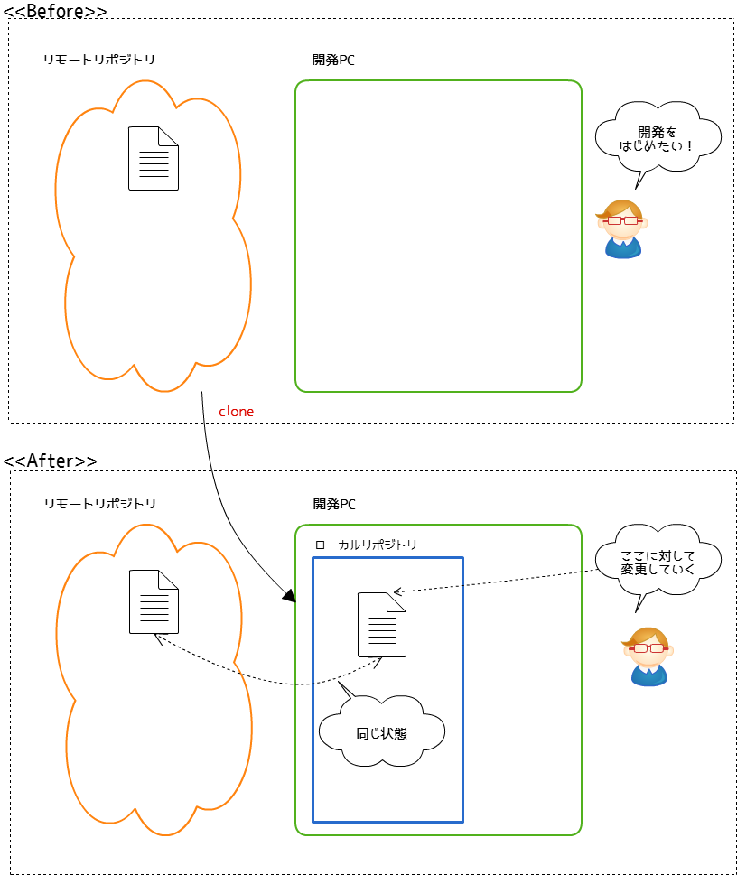
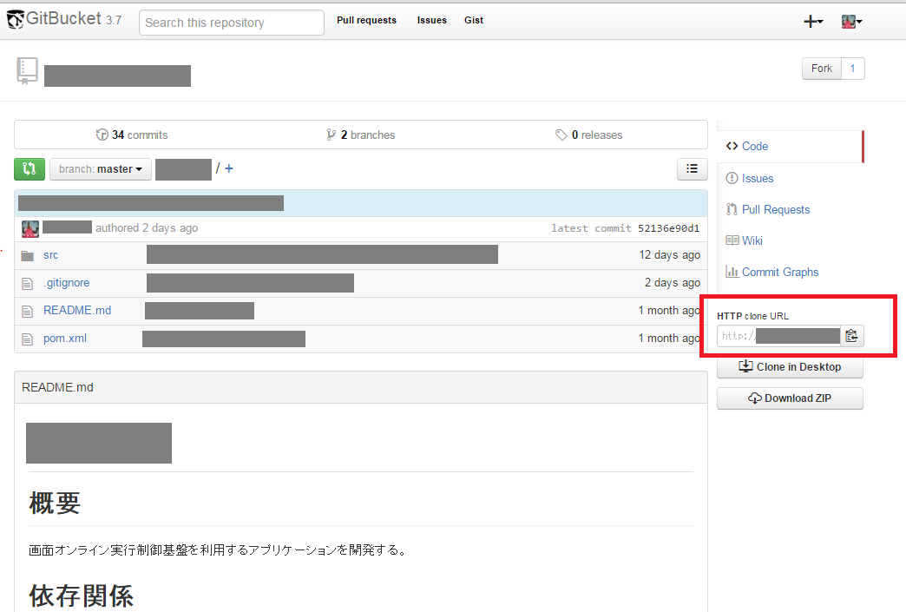
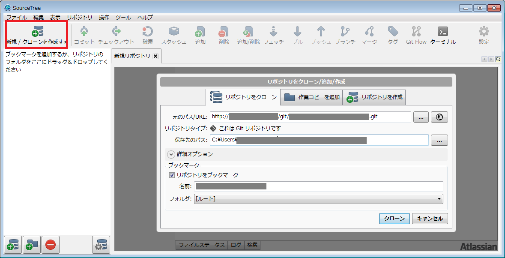

# プロジェクト参加のときにやること(clone)

## 概要

開発PCへリモートリポジトリのソースコードを取得しましょう。  
※Subversionでいう、チェックアウトです。  
本作業を実施することで、ローカルリポジトリが新たに作成され、  
リモートリポジトリと同じ状態のソースコードを手に入れることが出来ます。

## 事前準備

- gitのインストールおよび初期設定が完了している
- SourceTreeのインストールが完了している

## 作業内容

① ブラウザからgitBucketを開いてください。
② 赤枠の文字列をコピーしてください。

③ SourceTreeを起動してください。
④ 赤枠のボタンを押し、出てきた画面に以下を入力する
   - 元のパス/URL ：　gitBucketからコピーしてきたURL
   - 保存先のパス：ワークスペースにしたいフォルダ
   - ブックマーク＞名前：そのまま

⑤ クローンボタンを押してください。これが、イメージ図の"**clone**"の作業です。

### 事後確認

開発PCに、リモートリポジトリと同じ状態のリポジトリがローカルに生成されました。  
指定したフォルダにファイルが格納されています。