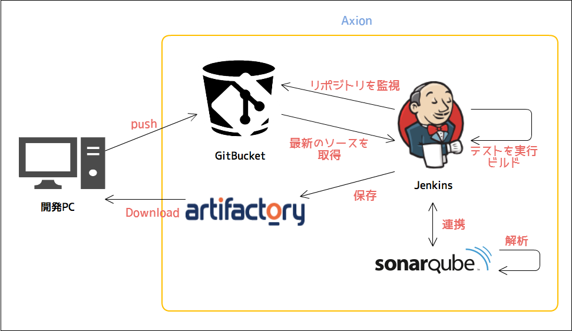

# 開発の流れ

PG・UT中の構成管理の流れを以下に記載します。

- バージョン管理はGit / GitBucketを使用します。
- ビルドツールおよびライブラリ管理はmaven / Artifactoryを使用します。
- CIはJenkinsを使用します。
- ソースコードの品質監視にはsonarQubeを使用します。

1. 開発PCにてソースコードを変更し、gitにてバージョン管理を行います。
2. **GitBucket**にpushし、GitBucketにてソースコードのバージョン管理を行います。
3. **Jenkins**が、GitBucketから最新のソースコードを取得し、テスト＋ビルドを実行することで、アプリケーションが常に動作する状態か監視します。
4. Jenkinsと**sonarQube**が連携されており、ソースコードの品質を常に監視しています。
5. Jenkinsから各モジュールをライブラリ(jar)として**Artifactory**に格納することで、開発者は最新のモジュールを取得することが出来ます。
(アーキチームやDBAの管理ソースは、ライブラリとして提供されます。)

## Gitについて

### Gitの使い方

Gitの使用方法を以下ドキュメントに記載します。  
コミットコメントやレビュー方法についても記載しているので、目を通してください。

[★Gitの利用ガイド](./git.html)

mavenを使うよというはなし
バージョニング～
開発中はSNAPSHOTでいくぞ！

JenkinsとSonarQubeをみましょうという話し
レビューの事前チェックにいれる…？
PG・UTの完了条件には入ってるけど。。。
SonarQubeをどうやって運用しようか

データモデルの運用
DBAがやること～
RedmineでDBAのチケット受付もやりたい
申請はPF2が考えてくれる。
開発環境への適用はこっちがまとめる
