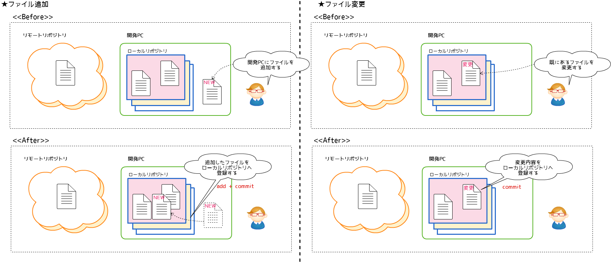
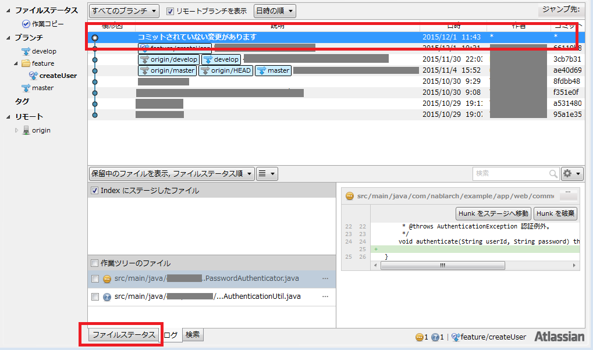
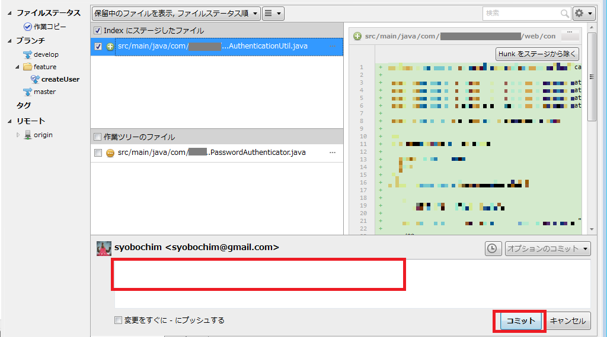

# 開発中にやること(ローカルでの作業)

開発の記録を保存していきましょう。  
基本的に、「タスクとして一段落したらコミットする」ようにし、こまめにコミットしましょう。  
コミットしても、プッシュ（後述）するまでは他の開発者に対して変更は展開されません。  
コミットメッセージは、**必ず作業内容がわかるように記載しましょう。**  
  
**★コミットメッセージの悪い例**

- SQLファイルを修正
- 12/1作業分コミット
- 一旦コミット
  + なにを修正したのかがわからない

**★コミットメッセージのいい例**

- ダウンロードのヘッダ部について、yyyyMM形式からyyyy年MM月形式へ変更
- 画面の開きかたを修正。同一画面にて開くようにした
  + 変更内容を具体的に記載しており、なにをしたのかがわかる。
- refs #123
  + ※refs #(Redmineのチケット番号)
  + チケット番号から、なにをしたのかがわかる。

## 作業の流れ

Subversionでは、新規作成ファイルのみ追加(add)を実行し、ファイルを変更するときはコミット対象にチェックを付けてコミット(commit)を行います。  
gitでは、新規作成・ファイル変更に関わらず、コミット対象にチェックを付け(add)て、コミット(commit)を行います。
addに対しての操作内容が異なりますので、注意してください。
（SourceTreeでは、addもcommit同じ操作になります。）

## 実際の操作

① SourceTreeを起動します。  
② 「コミットされていない変更があります」の表記を確認し、「ファイルステータス」タブに切り替えます。

※？は追加したファイル、…は更新したファイルです。  
  
③ 変更内容を確認し、コミット対象ファイルを選択する。  
※必ず**コミットしたいファイルを選んで**チェックを付けてください。コミットメッセージにあったファイルを選択すること。  
④ 赤枠にコミットメッセージを記載する。  

⑤ コミットボタンを押してください。これがイメージ図の**add + commit**です。  

## 完了状態

開発PCに作業記録を保存することが出来ました。  