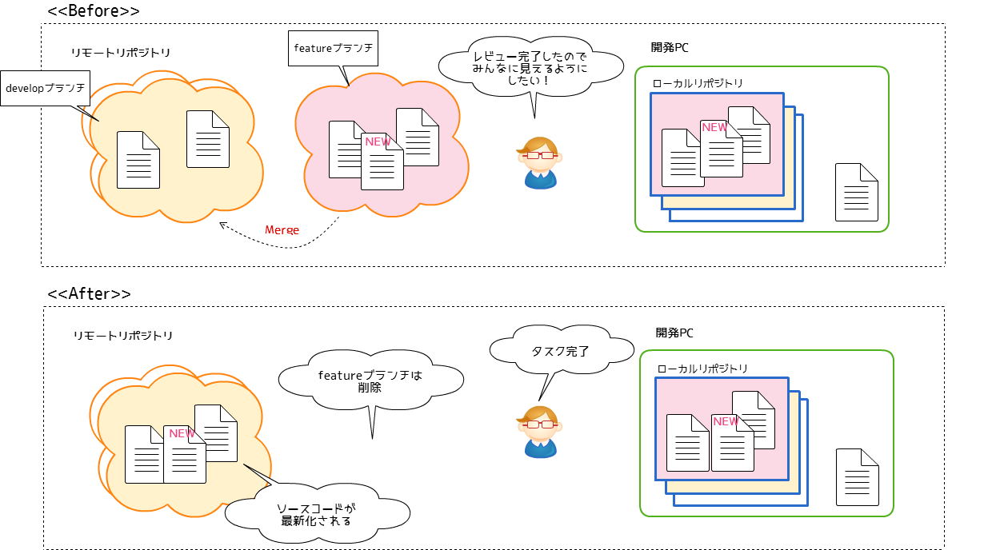
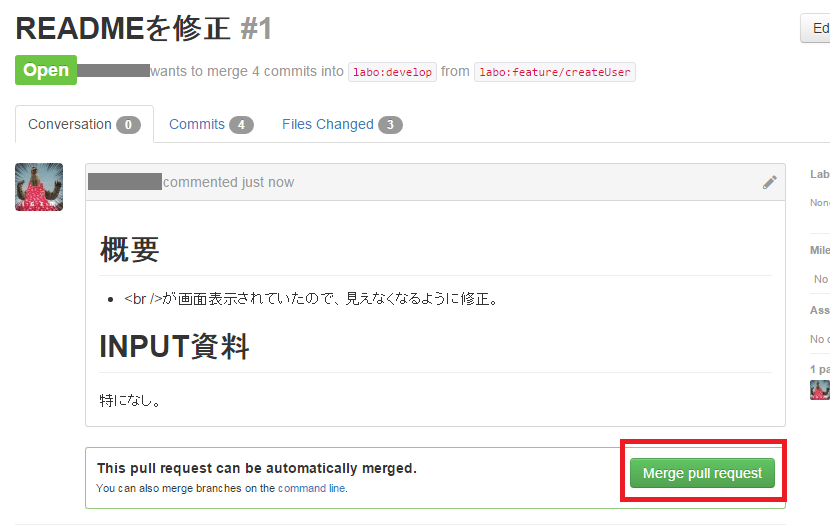
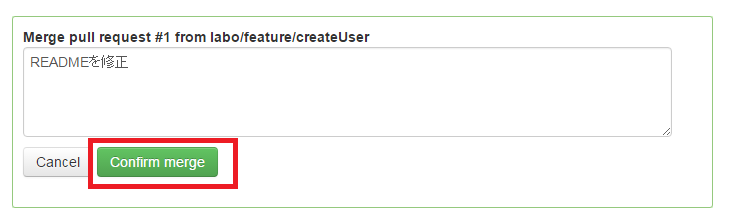
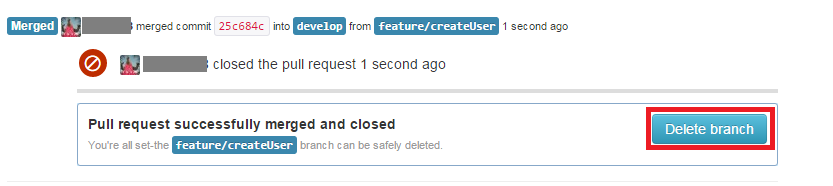

# レビュー合格後にやること(レビュアーが実施)

## 概要

レビューし、内容に問題がなければ、featureブランチをdevelopブランチへマージしましょう。  
developブランチへマージすると、他の開発者に対して変更内容を展開することが出来ます。

## イメージ図

## 手順

① gitBucketの画面を開きます。
② Merge pull requestボタンを押します。

③ Confirmマージボタンを押します。これがイメージ図の**Merge**です。

④ Delete branchボタンを押して、不要になったブランチを削除しましょう。
※ブランチを削除しても、コミットの記録およびpull requestは"Close"のステータスで残ります。

## 完了状態

developブランチに変更が反映されています。  
featureブランチが削除されています。  

これで、開発作業は完了です。おつかれさまでした。