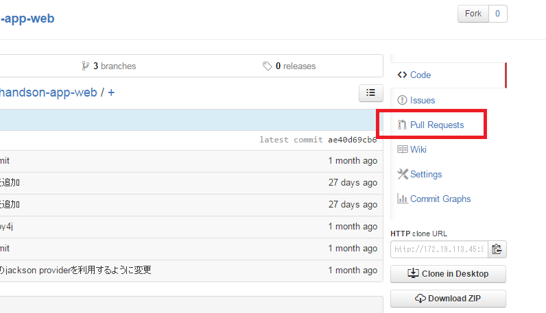
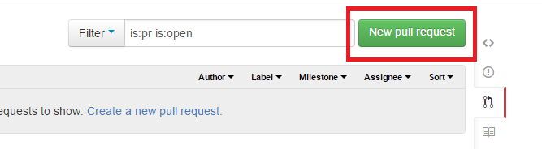
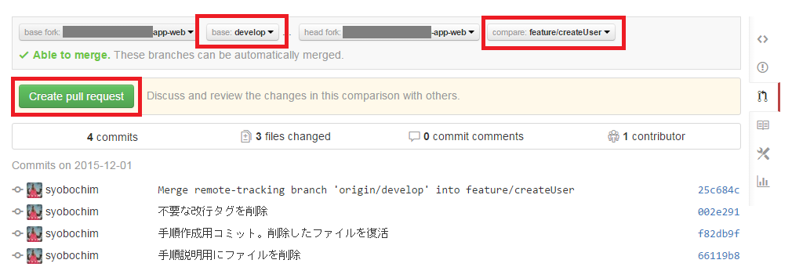
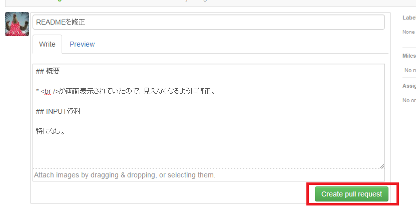

# レビュー依頼のときにやること

タスクが完了したら、レビュアーにレビュー依頼を出しましょう。  
gitBucket上でpullRequest機能を使用することで、developブランチとfeatureブランチの差分を確認することが出来ます。  
レビューOKのもののみ、developブランチへ反映させることが出来ます。  
※本作業を怠ると、品質が保証されていないソースコードが他の開発者の環境に適用されてしまいます。必ず実施してください。  

### イメージ図


### 手順

① gitBucketの画面をひらきましょう。  
② Pull Requestsのリンクを押します。



③ New pull requestボタンを押す。



④ baseブランチにdevelopブランチを指定し、headブランチにfeatureブランチを指定する。  
⑤ Create pull requestボタンを押す。



⑥ ソースコードの差分が表示されるので、内容を確認してください。レビュー対象のみ、表示されているようにしましょう。  
⑦ レビュー内容を、レビュアーにわかるよう記載しましょう。  
以下項目を記載してください。(Markdown記法を使用することで、タイトルなどを見やすくすることが出来ます。)

```
## 概要

* なぜこの変更をするのか、
* 課題は何か、
* これによってどう解決されるのか、
* など、この変更に対する概要を記載

## INPUT資料

何をINPUTにしたか
```



⑦ Create pull requestボタンを押してください。これが、イメージ図の**pullRequest**です。  
**Merge pull requestボタンが活性になっていることを確認してください。**  
活性になっていない場合は、『開発中にやること（リモートブランチへの反映）』の章をやり直してください。

### 完了状態

プルリクエストを作成することが出来ました。  
Merge pull requestボタンが活性になっていますか？  
レビュー内容がConversationタグで確認できます。  
対象コミットがCommitsタグで確認できます。  
developとfeatureの差がFile Changedタグでファイル差分を確認する事ができます。