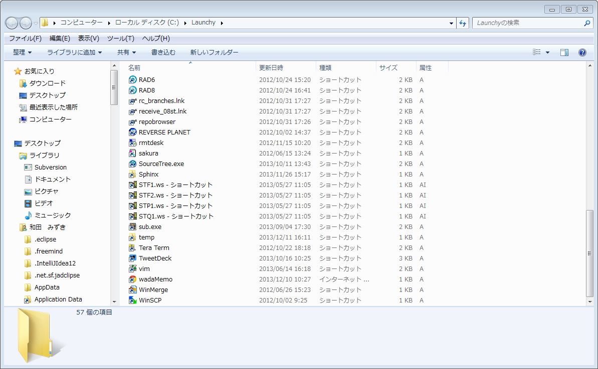

============================================================
便利ツール
============================================================

.. contents:: 目次
   :depth: 3

キーバインド系
============================================================

AutoHotKey
-----------------------------------------------------

| 出来ること：キーマッピング
| **コマンドプロンプトでCtrl + V (貼り付け)とかも出来るので捗る**
|
| http://www.autohotkey.com/
|
| インストールフォルダ内(か、ホームディレクトリ内？)にある、
| AutoHotKey.ahkファイルをエディタで開いて、記述を全消しして、
| あとは、サイトとかをみて、使いたいキーバインドを見つけて、
| それを参考にファイルの中身を追加していった。
|
| 作成したAutoHotKey.ahkファイルをスタートアップフォルダとかに置けば、
| PC起動時に適用される。
|
| コマンドプロンプトでコピペなど
| 範囲選択：Ctrl + k
| コピー　：Ctrl + x
| 貼り付け：Ctrl + v
| 全選択　：Ctrl + a
| 検索　　：Ctrl + f
| ↓をまるっと書けばOK

::

   ; コマンドプロンプトでの動作
   #IfWinActive,ahk_class ConsoleWindowClass
   ^k::Send,!{Space}ek ;範囲選択
   ^x::Send,!{Space}ey ;コピー
   ^v::Send,!{Space}ep ;貼り付け
   ^a::Send,!{Space}es ;全て選択
   ^f::Send,!{Space}ef ;検索
   #IfWinActive

|
| ちなみにわだの全量AutoHotKey.ahk
| https://gist.github.com/syobochim/7093324
|

ChgKey
-----------------------------------------------------

| 出来ること：キー割り当ての変更
| AutoHotKeyよりも簡単にキー割り当ての変更が出来る。
|
| windows7の場合は、AutoHotKeyでは「CapsLockキーをCtrlキーに変更」が上手くいかなかったので、
| コレを使用した。
|

.. warning::

   ツールによってレジストリの変更を行うので注意！！

|
| http://pcgenki.com/soft3/changekey.htm
|
| ちなみにわだの変更内容
| CapsLockキーをCtrlキーに変更
| ScrollLockキーをCapsLockキーに変更　(これは好みの問題です。)
| 半角/全角キーをEscキーに変更　(これは好みの問題です。)
|

コントロールパネルでキーバインドの変換
------------------------------------------------------

| 下記を参照。
| 変換キーをIME-ON、かたかなひらがなキーをIME-OFFに割り当てている。
|
| http://www.karakaram.com/mac-ime

ランチャー系
===============

Listary
-----------

| 出来ること：Windowsエクスプローラにインクリメンタルフィルタを付加する

http://f.daccot.com/2011/12/28/10431/

| めっちゃ捗る
|

Launchy
---------------

| 特定のアプリやフォルダ、ファイルの起動は、ListaryよりもLaunchyの方が捗る
|

| http://tokuna.blog40.fc2.com/blog-entry-1326.html
| http://geekna.hatenablog.jp/entry/20071117/p1

| こんな感じでショートカットをまとめてる
|

|

その他
===========================

WindowsでUNIXコマンドを使おう
====================================

| てんてんさんのブログ
| http://tenten0213.hatenablog.com/entry/2013/10/01/010808
|
